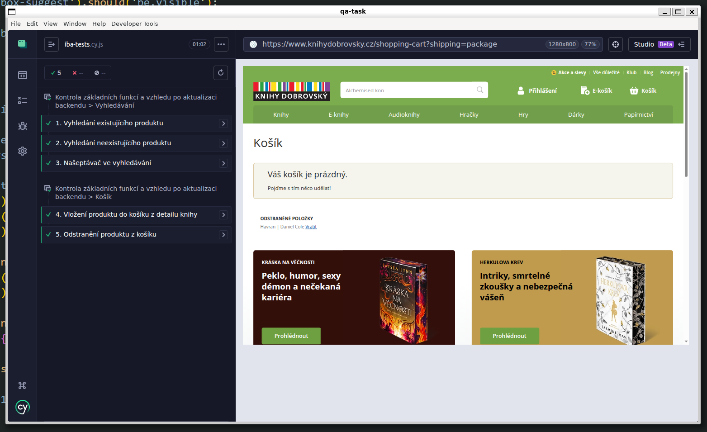

# QA Task: Cypress Automation - Knihy Dobrovský

This repository contains automated E2E tests for the Knihy Dobrovský e-shop. The goal was to verify core functionality and backend data integrity.

##  Tests
1. **Search & Cart (Happy Path)** – Searching for a specific product and adding it to the cart.
2. **Main Menu Navigation** – Verifying that category links work and content renders correctly.
3. **Negative Search (Error Handling)** – Testing the system's response to non-existent search terms (checking the "Dobrobot" error page).

